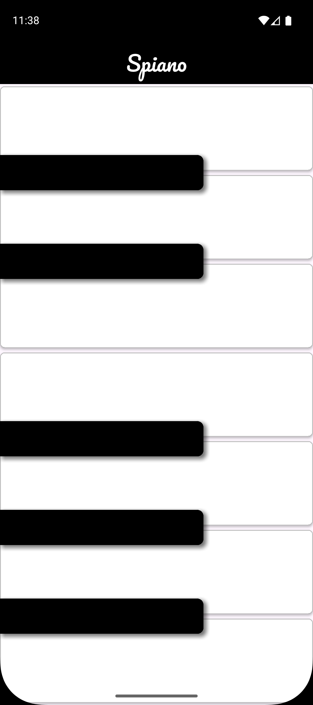

# 🎹 Spiano - Piano App 🎶

## Description
Spiano is an interactive piano app built with Flutter. It allows users to play piano sounds using white and black keys that mimic a real piano. Perfect for beginners and casual music enthusiasts.

## Features ✨
- Responsive design supporting different screen sizes.
- Separate white and black piano keys with distinct touch effects.
- High-quality piano sounds powered by the `audioplayers` package.
- Smooth and fast touch response with animated key press feedback.
- Clean and modular Flutter code architecture.

## Technologies Used 🛠️
- Flutter & Dart
- audioplayers (for sound playback)

## Requirements ✅
- Flutter SDK (version 3.0.0 or higher)
- Dart SDK
- A device/emulator to run the app

## Getting Started 🚀
To run this app locally, follow these steps:
1. Make sure Flutter and Dart are installed on your machine
2. Clone the repository:
```bash
   git clone https://github.com/your_username/spiano.git
```
3. Navigate to the project directory:
```bash
   cd spiano
```   
4. Get the Flutter packages:
```bash
   flutter pub get
```   
5. Run the app on an emulator or physical device:
```bash   
   flutter run
```
## Project Structure 📁
Here is a quick overview of the main files and folders in this project:
- `lib/`
  - `main.dart`: Entry point of the app, sets up the MaterialApp and home screen.
  - `screens/spiano_home.dart`: The main screen displaying the piano layout.
  - `components/`
    - `white_button.dart`: Widget for the white piano keys.
    - `black_button.dart`: Widget for the black piano keys.
  - `models/`
    - `piano_button_model.dart`: Defines the PianoButtonModel class which holds sound data and plays audio.

- `assets/sounds/`: Folder containing the piano sound files (`sound_1.wav`, `sound_2.wav`, etc.).

This structure keeps the code modular and easy to maintain.

## 📸 Screenshots

Below are some screenshots showcasing the look and feel of the **Spiano** app:

### 🎹 Home Screen  
           
   
## 🔧 How It Works
The **Spiano** app simulates a vertical piano layout using a combination of white and black keys. Here's a brief explanation of how the logic works:

- The UI is built using a `Stack` to layer black keys on top of white keys.
- The white keys are displayed in a `Column`, each being an `Expanded` widget for equal spacing.
- Black keys are positioned absolutely using `Positioned` and a dynamic value based on their relation to white keys.
- Pressing a key (white or black) triggers a sound using the `audioplayers` package.
- Each key is represented by a `PianoButtonModel` object, holding its corresponding sound file and (for black keys) its vertical position index.
- Touch feedback is handled with `GestureDetector` and slight color changes for interaction.

The app is fully responsive and adapts key height/positioning based on the screen size.

## 🤝 Contributing
Pull requests are welcome. For major changes, please open an issue first to discuss what you would like to change.

Don’t forget to ⭐️ the repo if you like it!


